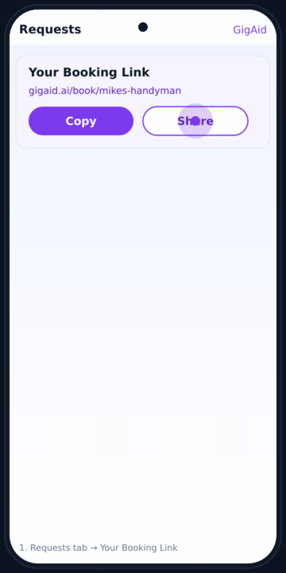
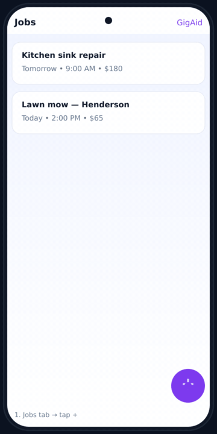
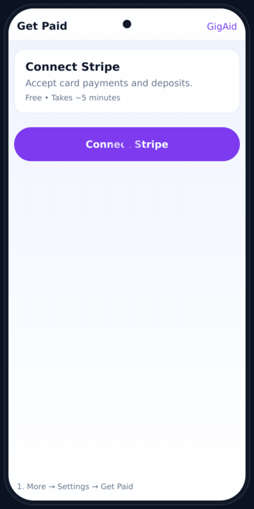
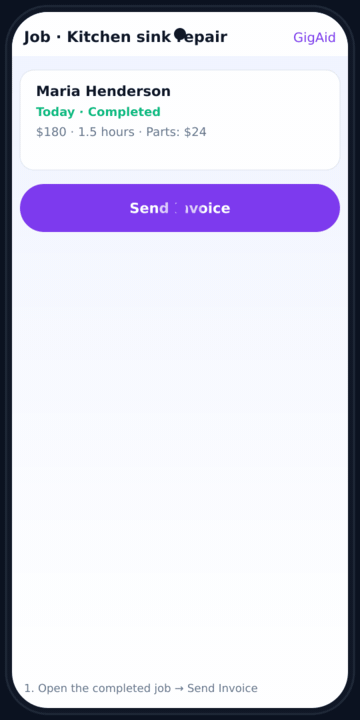
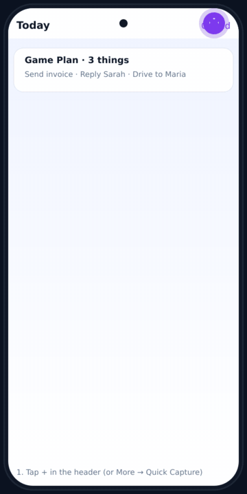

# GigAid Support Manual

Welcome to GigAid! This manual is here to help you get the most out of the app. Whether you're just getting started or you've been running jobs for months, you'll find friendly walkthroughs of every feature, plus tips that can save you time and help you get paid faster.

If something isn't working the way you expect, jump to the **Troubleshooting** section at the end. And if you can't find an answer here, reach out at **support@gigaid.ai**.

---

## Table of Contents

1. [Getting Started](#1-getting-started)
2. [Booking Link & Public Page](#2-booking-link--public-page)
3. [Leads & Booking Requests](#3-leads--booking-requests)
4. [Jobs](#4-jobs)
5. [Invoices & Payments](#5-invoices--payments)
6. [Messages & Client Communication](#6-messages--client-communication)
7. [AI Features](#7-ai-features)
8. [Plans & Billing](#8-plans--billing)
9. [Account & Privacy](#9-account--privacy)
10. [Troubleshooting](#10-troubleshooting)

---

## 1. Getting Started

### Welcome to GigAid

GigAid is built for solo gig workers — plumbers, cleaners, handymen, lawn pros, movers, tutors, and anyone else running their own show. We help you keep track of leads, schedule jobs, request deposits, send invoices, and get paid, all from your phone or computer.

You don't need to be tech-savvy to use it. If you can text a customer, you can run your business in GigAid.

### Creating your account

The first time you open GigAid, you can sign up three ways:

- **Sign in with Apple** (best on iPhone — uses your Apple ID, no password to remember)
- **Sign in with Google**
- **Email and password**

Pick whichever feels easiest. You can always link the others later in **Settings**. Apple sign-in is fastest on iPhone because it uses Face ID or Touch ID, and Apple keeps your real email private if you want.

After signing in, you'll be asked a few quick questions: your name, what services you offer, and your service area. Don't overthink this — you can change all of it later from your **Profile** page.

### The first 5 minutes

Here's what we recommend doing the moment you're signed in:

1. **Add your business info.** Tap the **More** tab (bottom right), then **Profile**. Add your business name, phone number, and the services you offer. This is what shows up on your booking link.
2. **Set up your booking link.** From the **Requests** tab, you'll see a card called *Your Booking Link*. Share that link with anyone who wants to book you — Facebook, Instagram, your email signature, the back of your truck. Customers can fill out a request form 24/7.
3. **Connect Stripe** (optional but recommended). If you want to accept card deposits or send paid invoices, head to **More → Settings → Get Paid** and tap **Connect Stripe**. You'll be guided through a quick verification with Stripe.
4. **Try Quick Capture.** Tap the **+** button in the top bar (or open **More → Quick Capture**). Snap a photo or jot a note from a job site, and we'll help you turn it into a job, lead, or invoice.

### The main tabs

GigAid has five main areas at the bottom of the screen:

- **Plan** — Your *Game Plan* for the day. Schedule, what to do next, and urgent follow-ups.
- **Jobs** — Every job you've ever scheduled, in one place.
- **Requests** — New leads and booking requests waiting for you.
- **Get Paid** — Invoices, deposits, and payment history.
- **More** — Everything else: Booking Requests, Messages, Crew, Settings, your Profile, and AI tools.

Tap any tab and explore. Nothing you do in GigAid is permanent unless you delete it on purpose.

---

## 2. Booking Link & Public Page

### What is the booking link?

Your booking link is a public web page where customers can request appointments with you, 24 hours a day. Every GigAid account gets one, and it works whether you're on the Free, Pro, Pro+, or Business plan.

Your link looks like this: **gigaid.ai/book/your-business-name**

When someone visits it, they see your business name, your services, and a friendly form they can fill out: name, phone, email, what they need, when they'd like the job done, and any photos they want to share.

### Setting up your booking page

Go to **More → Profile** (or **More → Settings → Get Booked**) and fill in:

- **Business name** — what customers see at the top
- **Bio** — a short paragraph about who you are. Keep it warm. "Hi, I'm Mike. I've been doing handyman work in Austin for 12 years."
- **Services** — the list of services you offer. Customers pick from these on the form.
- **Service area** — your city or ZIP code
- **Logo or photo** — optional, but it builds trust

Hit **Save**, and your booking page is live.

### Sharing your link

There are a few easy ways to get your link in front of customers:

- Copy and paste it into your **Facebook bio** or **Instagram bio**
- Add it to your **email signature**
- Print it on a **business card** or flyer for in-person hand-offs
- Reply to neighborhood requests on **Nextdoor, Craigslist, or Facebook Marketplace** with your link

### What happens when someone books?

When a customer fills out your booking form, three things happen:

1. The request shows up under **More → Booking Requests**
2. You get a notification (push or email, depending on your settings)
3. A new lead is created automatically under your **Requests** tab

You can then accept, decline, or message the customer right from the app.

### Requiring a deposit on bookings

If you want to make sure people show up, you can require a small deposit when they book. Go to **More → Settings → Get Paid** and turn on **Require Deposit**. You can set a flat amount (like $25) or a percentage (capped at 30%) — whichever feels right for your jobs.

Customers pay the deposit by card right on the booking page. The money is held by Stripe and released to you after the job is complete.

> **Heads up:** Deposit requirements need a connected Stripe account. Free plan members can require one deposit per month. Pro+ and Business get unlimited deposits.

---

## 3. Leads & Booking Requests

### What's a lead?

A lead is anyone who's interested in your services but hasn't booked a confirmed job yet. Leads come from a few places:

- **Booking requests** from your public link
- **Manual leads** you add yourself (from a Facebook message, a phone call, a referral)
- **Quick Capture** from your phone when you're on the go

Every lead has a status that helps you keep track of where things stand:

- **Just Added** — fresh, hasn't been contacted
- **Awaiting Reply** — you reached out, waiting to hear back
- **Talking** — actively in conversation
- **Ready to Book** — you've agreed on price, just need to schedule
- **Gone Quiet** — no reply for a while, probably cooling off
- **Not Interested** — they passed, archive and move on

### Adding a lead manually

Tap the **+** button on the **Requests** page (or use **Quick Capture**). Fill in the customer's name, phone, the type of service they need, and any notes. Hit **Save**.

If you only have a phone number, that's fine — start there and fill in the rest as you learn it.

### The lead detail page

Tap any lead to open their full profile. From here you can:

- **Call** them directly
- **Text** them (we send the message through your connected number)
- **Email** them with an AI-suggested reply
- **Send a price confirmation** so they can lock in your quote
- **Convert to job** when they're ready to book

### AI follow-ups

This is one of the most-loved features. On any lead, tap **Follow Up** and we'll write a friendly, professional message for you. You can pick a tone — friendly, professional, or casual — and tweak the message before sending.

Great for those leads that have gone quiet for a few days and you don't know what to say.

### Lead heat: Hot, Warm, Cold

You'll see a little flame, sun, or snowflake icon next to each lead. That's the *heat score* — our best guess at how likely the lead is to convert based on response speed, message length, and signals like "ready to schedule." Use it to prioritize your day.

### Booking Requests vs. Leads

A **booking request** is a specific kind of lead — one that came in through your booking link with a requested date and time. You'll find these under **More → Booking Requests**.

When you accept a booking request, it becomes a confirmed job on your calendar. When you decline it, the customer gets a polite notification and the lead stays in your Leads list so you can still follow up later.

---

## 4. Jobs

### Creating a job

There are three ways to add a job:

1. **From a lead** — open the lead and tap **Convert to Job**
2. **From scratch** — tap the **+** button on the **Jobs** tab
3. **From a template** — on the New Job screen, pick a saved template (like "Bathroom Deep Clean" or "Lawn Mow") and we'll prefill the price, duration, and message for you

### What goes in a job

Every job has:

- **Title** — what to call it (e.g., "Kitchen sink repair")
- **Service type** — picked from your service list
- **Customer** — name, phone, optional email
- **Date and time** — when you're showing up
- **Duration** — how long you expect it to take
- **Location** — the address (we'll show it on a map and offer to navigate)
- **Price** — what you're charging
- **Notes** — anything you want to remember (gate code, dog warning, parking tips)

You can also attach **photos** (great for before-and-after shots) and add **crew members** if you have helpers on the job.

### Job templates

If you do the same kinds of jobs over and over, GigAid comes with starter templates for common categories — Handyman, Cleaning, Lawn, Moving, and Tutoring. Open the **New Job** screen and pick one to prefill the price, duration, deposit policy, and default customer message.

Next time, creating a job takes about 10 seconds.

### Job status

Jobs move through these statuses:

- **Scheduled** — on the calendar, not started yet
- **In Progress** — you're working on it
- **Completed** — done and ready to invoice
- **Cancelled** — didn't happen

When you mark a job complete, we'll prompt you to send an invoice (if you haven't already) and ask the customer to pay any remaining balance.

### Drive Mode

When you're driving to a job, tap the **Drive Mode** button on the home screen or job detail page. This gives you a simplified, big-button view designed for use in the car: customer name, address, "Navigate" button, and a one-tap "I'm on my way" text to the customer.

> Please don't tap your phone while actually driving. Use voice or pull over.

### Plan limits on jobs

- **Free plan**: up to 5 jobs per month
- **Pro, Pro+, Business**: unlimited

If you hit the Free limit, you'll see a friendly nudge to upgrade. The counter resets each month.

---

## 5. Invoices & Payments

### Connecting Stripe

To get paid by card, you need to connect a Stripe account. It's free, takes about 5 minutes, and unlocks everything below.

Go to **More → Settings → Get Paid** and tap **Connect Stripe**. Stripe will ask for:

- Your legal name and date of birth
- Your business address
- A bank account for payouts (routing and account number)
- Your Social Security Number (for US tax reporting)

This information goes directly to Stripe — GigAid never sees or stores your SSN or bank details. Once approved (usually instantly, sometimes a day or two), you're good to go.

### Sending an invoice

From any completed job, tap **Send Invoice**. We'll prefill the customer, the amount, and a description. You can edit anything, then hit **Send**.

The customer gets a text and/or email with a link to pay by card. Once they pay, the money lands in your Stripe account, and Stripe sends it to your bank on its normal payout schedule.

### Recording cash, Zelle, Venmo, or check

Not every customer pays by card. When you get cash, Zelle, Venmo, Cash App, or a check, just tap the invoice or job and select **Mark as Paid**. Pick the payment method, add a note if you want, and we'll log it in your reports.

### Deposits

Deposits help reduce no-shows. There are two ways to use them:

- **On booking requests** — required when a customer books through your link
- **On jobs** — added to a specific job after the fact

Set a deposit by going to the booking or job and tapping **Request Deposit**. You can choose a flat amount or a percentage (up to 30% of the job price).

Stripe holds the deposit until the job is complete. If a customer cancels last-minute, you can keep the deposit (this is called *risk protection*). Pro+ and Business plans unlock unlimited deposit risk protection.

### Plan limits on payments

- **Free**: 1 enforced deposit per month, basic invoicing
- **Pro**: unlimited invoices, basic deposit holds
- **Pro+**: unlimited deposits with risk protection
- **Business**: everything in Pro+, plus crew accounts

### Tax time

Stripe generates a 1099 for you at the end of the year if you earn over the IRS threshold. You can also pull a copy of your account data anytime from **More → Settings → Account → Export Data**.

---

## 6. Messages & Client Communication

### Texting customers

You can send a text to any lead, customer, or job contact right from inside GigAid. Tap the **Text** button on any contact card and the message box opens.

We send through a verified business number so customers can reply, and replies show up under **More → Messages**.

> **Plan limits on texting:**
> - **Free**: 20 SMS replies per month (replies only — you can't send a brand-new conversation)
> - **Pro**: unlimited SMS
> - **Pro+**: 300 SMS per month with smart message templates
> - **Business**: 1,500 SMS per month, plus team-shared inbox

### AI-suggested replies

When a customer texts or emails you, we'll suggest a reply that matches the tone of the conversation. Tap the suggestion to use it as-is, or tap **Edit** to tweak it.

This is great for those moments when you're at a job site and don't have time to write a thoughtful response.

### Email conversations

If you've added a customer's email, you can also send and receive emails from inside GigAid. Useful for sending quotes, photos, or longer messages.

Email conversations are threaded so you can see the whole back-and-forth in one place.

### Automatic messages

GigAid can send messages on your behalf for things like:

- **Auto Booking Confirmation** — sends when you schedule or reschedule a job
- **Auto Follow-up** — checks in after a job is complete
- **Payment Reminder** — nudges customers about unpaid invoices

Turn these on or off and customize the message text in **More → Settings → Automate**.

---

## 7. AI Features

GigAid's AI is built to help you work faster, write better messages, and never miss a follow-up. Here's every AI feature in the app and how to use it.

### Today's Money Plan

Open the **Money Plan** page (from your sidebar, or visit **/money-plan**) to see *Today's Money Plan* — a focused list of the deposits and invoices you should chase today. The AI sorts everything by what's most likely to bring money in the door first.

### AI Nudges

Throughout the app you'll see little purple **AI Suggestions** chips on leads, jobs, and invoices. These are *AI Nudges* — short, in-the-moment ideas like "Send a follow-up text" or "This lead has been quiet for 4 days." Tap any nudge to see suggested actions and one-tap responses.

### Voice Notes

Inside Quick Capture (and on most note fields), tap the microphone icon to record a **voice note**. The AI transcribes what you said and offers to turn it into a job, a lead, or a customer message. Perfect for capturing a quote on the way back to your truck.

### Price Estimator

Not sure what to charge? Open any lead or job (or use it on your public booking page) and tap **Estimate Price**. Tell the AI what the job involves, and it suggests a fair price based on your past jobs, your service area, and typical rates. You can always override it.

### Follow-Up Composer

On any lead, tap **Follow Up**. The Follow-Up Composer writes a friendly, professional message for you. Pick a tone — friendly, professional, or casual — and tweak the message before sending. Great for those leads that have gone quiet for a few days.

### AI Co-Pilot

Tap the **Sparkle** icon (or open **More → AI Co-Pilot**) to chat with the **AI Co-Pilot**. Ask it anything: "What jobs do I have tomorrow?", "Draft a quote for a kitchen remodel," or "Which customers haven't paid yet?" It pulls from your data and answers in plain English.

### Quick Job Entry

When you start a new job, the AI watches what you type and prefills the rest — service type, duration, even a starter price — based on your past jobs. This is **Quick Job Entry**, and it usually cuts new-job creation time to under 30 seconds.

### Quick Capture

Tap the **+** in the header (or open **More → Quick Capture**). You can:

- **Take a photo** of a job site, receipt, or business card
- **Record a voice memo** of an idea or to-do
- **Type a quick note**
- **Paste a screenshot** of a Facebook message or Craigslist post

We'll suggest what to do with it: turn it into a job, a lead, an invoice, or just save it as a note.

### Booking Insights

Open **More → Owner View** to see **Booking Insights** — an AI-generated summary of where your bookings come from, your busiest days, your average lead-to-booking time, and tips on how to lift your booking rate.

### Bio Rewrite

Inside **More → Profile**, tap the **Sparkle** icon next to your bio field to use **Bio Rewrite**. The AI takes whatever you've written and rewrites it in a warmer, more professional tone. Try a few versions and pick your favorite.

### FAQ Assistant

Your public booking page includes an **FAQ Assistant** that answers common customer questions ("Do you do same-day jobs?", "Do you bring your own tools?") using your profile and past job data. Customize the answers anytime from your booking page settings.

### Review Generator

After a completed job, the **Review Generator** drafts a polite text or email asking the customer for a Google or Yelp review, with a direct link. You approve before it sends.

### Campaign Suggestions

On Pro+ and Business, the AI watches your activity and suggests one-tap **campaigns** — things like "Text your last 10 cleaning customers about a spring deep-clean special" or "Re-engage 3 leads who went quiet last month." Open **More → AI Tools** to see the latest suggestions.

### Smart Scheduling

When you create a job, GigAid suggests times that don't conflict with your existing schedule and minimize your driving. Tap **Smart Suggest** in the date/time picker to see options ranked by efficiency.

### Profit Alerts

Pro+ and Business plans get **Profit Alerts** at **More → Profit Alerts**. We watch your jobs, deposits, and invoices for patterns — like a customer who hasn't paid an invoice in a while, or a slow week where you might want to push for more bookings — and ping you proactively.

### Owner View

The **Owner View** dashboard (under **More → Owner View**) gives you a bird's-eye summary: total revenue, top-earning service, slowest day of the week, average response time to leads, and more.

### Coaching tips

You'll occasionally see little blue tip cards on different screens — those are coaching tips. Context-aware suggestions like "Your Tuesdays are slow — want to send a discount text to your top 5 customers?" Dismiss any tip you don't want, and it won't come back.

---

## 8. Plans & Billing

### What plan should I be on?

We have four plans to fit different stages of business:

#### Free — $0
Best for: just getting started, trying things out
- Up to 5 jobs per month
- Basic invoicing
- Job scheduling
- Lead management
- Booking link

#### Pro — $19/month
Best for: solo workers running more than 5 jobs a month
- Unlimited jobs
- Auto follow-ups
- Two-way SMS
- Owner View dashboard
- Weekly summaries
- Priority support

#### Pro+ — $28/month
Best for: people who want deposits and risk protection
- Everything in Pro
- Deposit enforcement
- Booking risk protection
- Today's Money Plan
- Offline asset capture
- Priority alerts
- AI campaign suggestions

#### Business — $49/month
Best for: solo workers with helpers or a small crew
- Everything in Pro+
- Multi-provider support
- Team management
- Business analytics
- Admin controls
- API access

### Upgrading or downgrading

Go to **More → Settings → Account** and find the **Subscription** section. Tap **Change Plan** and pick the one you want. Upgrades take effect immediately. Downgrades take effect at the end of your current billing cycle, so you don't lose anything you've already paid for.

You can cancel anytime. There's no contract.

### Payment methods

We accept all major cards through Stripe. Update your card under **More → Settings → Account → Plan & Billing**.

### Refunds

If GigAid isn't working for you, email **support@gigaid.ai** and we'll do our best to make it right.

---

## 9. Account & Privacy

### Updating your profile

Go to **More → Profile** to change your name, business name, photo, services, bio, and service area.

### Changing your password or email

Go to **More → Settings → Account**. You can change your email, password, or linked sign-in methods (Apple, Google) here. If you signed up with Apple or Google, you don't have a password — you sign in through them.

### Notifications

Under **More → Settings → Account → Notifications**, you can turn on or off:

- **SMS Notifications** — texts to your phone for important updates
- **Email Notifications** — emails for the same updates

Push notifications are controlled by your phone's system settings (see Troubleshooting below).

### Privacy controls

We take your privacy seriously. Under **More → Settings → Account**, you can:

- **Manage analytics consent** — turn anonymous usage data sharing on or off
- **Download your data** — get a copy of everything we have on you
- **Delete your account** — permanently delete everything (this is final)

### App tracking (iPhone)

The first time you open GigAid on an iPhone, you'll be asked whether to allow tracking. If you say no, that's totally fine — the app works exactly the same. We only use that permission for some optional analytics, never to sell your data.

### What we share

We never sell your contact list, your customer data, or your messages. The only third parties we share data with are:

- **Stripe** — for payment processing (they need it to send you money)
- **Twilio** — for sending SMS messages (they need the phone number to deliver the text)
- **Firebase** — for sign-in (Apple and Google handle auth through them)

That's it. Full details are in our **Privacy Policy** linked at the bottom of **Settings**.

### Deleting your account

If you want to leave, go to **More → Settings → Account → Delete Account**. We'll ask you to confirm, then delete everything — your jobs, leads, messages, photos, payment history. This can't be undone, so download your data first if you want to keep it.

---

## 10. Troubleshooting

### I can't sign in

**With Apple:**
1. Make sure you're on iOS 13 or newer.
2. Go to your phone's **Settings → Apple ID → Password & Security → Apps Using Apple ID** and confirm GigAid is listed.
3. If you previously hid your real email when signing up, Apple's relay address is the one tied to your account — use it (not your real email) if asked.

**With Google:**
1. Pick the right Google account in the Google chooser. If you have multiple, the wrong one signs you into a different (empty) GigAid workspace.
2. If you see "account not found," use the same email you originally signed up with.

**With email and password:**
1. Tap **Forgot Password** on the sign-in screen and check your inbox (including spam).
2. Make sure caps lock is off.
3. If your email reset link expires, request a new one.

**Good to know:** You can link Apple, Google, and email/phone to the same account anytime under **More → Settings → Account → Account Linking** so you have multiple ways in.

**If something goes wrong:** Email **support@gigaid.ai** with the email you signed up with and the sign-in method you tried.

### I'm not getting notifications

1. Go to **More → Settings → Account** in GigAid and make sure notifications are turned on.
2. On your phone, go to **Settings → GigAid → Notifications** and make sure the system permission is enabled.
3. If you're using an iPhone with Focus Mode or Do Not Disturb on, GigAid notifications might be silenced.
4. Try logging out and back in.

### My booking link doesn't work

1. Make sure your profile has at least one service listed under **More → Profile → Services**.
2. Open the link in an incognito/private browser tab to see what customers see.
3. If you recently changed your business name, the link URL may have updated — copy the new one from the **Requests** tab or **More → Settings → Get Booked**.

### Stripe says "verification required"

Stripe sometimes asks for extra documents (like an ID photo or a utility bill) to verify your identity. Go to **More → Settings → Get Paid → Manage Stripe Account** and follow Stripe's prompts. This usually clears up within 24 hours.

### A customer says they paid but it's not showing up

- **Card payments** through GigAid show up instantly. If you don't see one, ask the customer for a confirmation email or transaction ID and forward it to **support@gigaid.ai**.
- **Zelle, Venmo, Cash App, cash, or check** payments need to be marked as paid manually. Open the invoice or job and tap **Mark as Paid**.

### My payout hasn't landed in my bank yet

Stripe runs payouts on its own schedule (which you can see inside your Stripe dashboard). A few common reasons one might be delayed:

1. **Verification still pending.** If Stripe is still asking for documents, payouts pause until that's resolved. Check **More → Settings → Get Paid → Manage Stripe Account**.
2. **Weekends and bank holidays.** Banks don't process payouts on those days.
3. **Wrong bank account.** Double-check the routing and account numbers in your Stripe dashboard.
4. **First payouts** sometimes take longer while Stripe verifies a brand-new account.

**If something goes wrong:** Open your Stripe dashboard for the exact payout status, and email **support@gigaid.ai** if you need help reading it.

### A text I sent didn't arrive

1. Confirm the customer's phone number is correct and in **+1 555-555-5555** format.
2. Some carriers block texts from new business numbers — ask the customer to reply "YES" to your first message to whitelist you.
3. Check **More → Messages** for a "delivery failed" badge on the message.
4. If you've hit your monthly SMS limit, you'll see a banner. Upgrade your plan or wait for the next billing cycle.

### I can't send a text

- **Free plan users** can only reply to existing conversations, not start new ones. Upgrade to Pro for unlimited new texts.
- If you've hit your monthly SMS limit, you'll see a banner telling you. Upgrade or wait for the next billing cycle.
- Make sure the customer's phone number is in **+1 555-555-5555** format.

### The app is slow or crashing

1. Close the app completely and reopen it.
2. Make sure you're on the latest version — check the App Store or Play Store.
3. Restart your phone.
4. If it's still slow, email **support@gigaid.ai** with details about your phone and what you were doing.

### Drive Mode can't find my location

Drive Mode needs GPS access to navigate and to send "on my way" updates.

1. On iPhone: **Settings → Privacy & Security → Location Services → GigAid → While Using the App**.
2. On Android: **Settings → Apps → GigAid → Permissions → Location → Allow only while using the app**.
3. Make sure your phone's overall Location Services switch is on.
4. If you're indoors, walk near a window — GPS is weak under heavy roofs.

**Good to know:** GigAid only uses your location when Drive Mode is open. We don't track you in the background.

### My data didn't sync after I came back online

GigAid lets you create jobs, leads, and notes while you're offline (no signal, basement, etc.). When you reconnect, the app syncs everything in the background. If you don't see changes after a minute:

1. Pull down to refresh on the affected screen.
2. Check the top of the screen for an **Offline** banner — it should disappear once you're connected.
3. Force-close and reopen the app to trigger a fresh sync.

**Good to know:** Photos taken offline are queued and uploaded once you're back online — you'll see an upload progress bar in the corner.

**If something goes wrong:** If anything appears missing after a sync, email **support@gigaid.ai** with the time and screen where you saw the issue. We can usually recover it from your sync log.

### I lost a job, lead, or message

Check your **Archived** filter on the Jobs or Requests page — sometimes things get archived by accident. If you really deleted something and need it back, email us as soon as you can.

### I want to switch from Free to Pro but I'm not sure

The fastest way to know: count your active jobs. If you're hitting the 5-job-per-month limit on Free, Pro pays for itself with one extra booked job. You can also try Pro for a month and downgrade if it's not for you.

### How to get extra help (escalation path)

When you need more than this manual can give you:

1. **Search this manual first** — use Ctrl/Cmd+F on the page to find your topic.
2. **In-app Help** — open **More → Help & Support** for direct links and FAQs.
3. **Email support** — write to **support@gigaid.ai** with a clear subject line ("Stripe payout missing," "Can't sign in with Apple," etc.). Include screenshots, the email tied to your account, and what you've already tried.
4. **Urgent payment issues** — for missing money or stuck payouts, mention "URGENT: payment" in the subject so we prioritize.

**Good to know:** Replies come from a real person, not a bot. We read every email.

### I need help with something not on this list

Email **support@gigaid.ai** and we'll get back to you. Include screenshots if you can — they help us help you faster.

---

## A final note

GigAid was built by people who've watched friends and family struggle to keep their gig businesses organized. We know how much heart you pour into your work, and we want the app to feel like a helpful coworker — never in your way, always making things easier.

If something feels off, tell us. If something works great, tell us that too. We read every email.

Thanks for trusting us with your business.

— The GigAid Team
